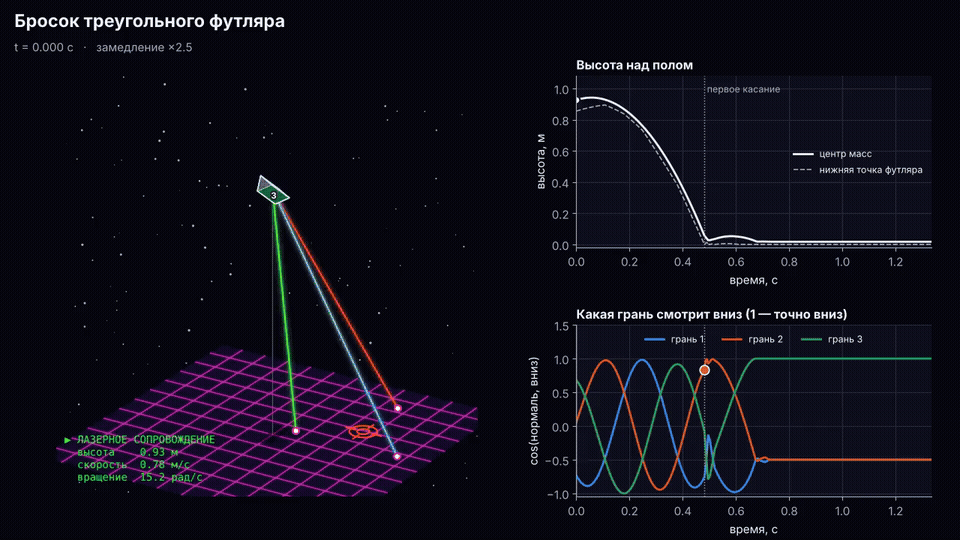
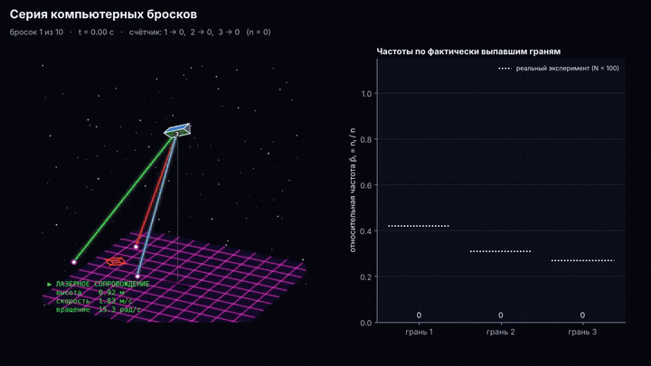
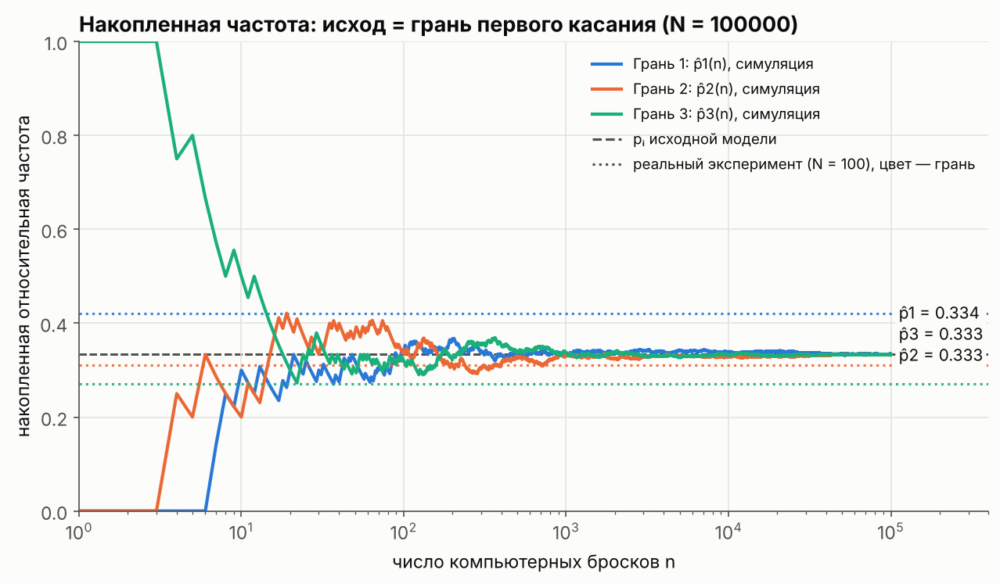
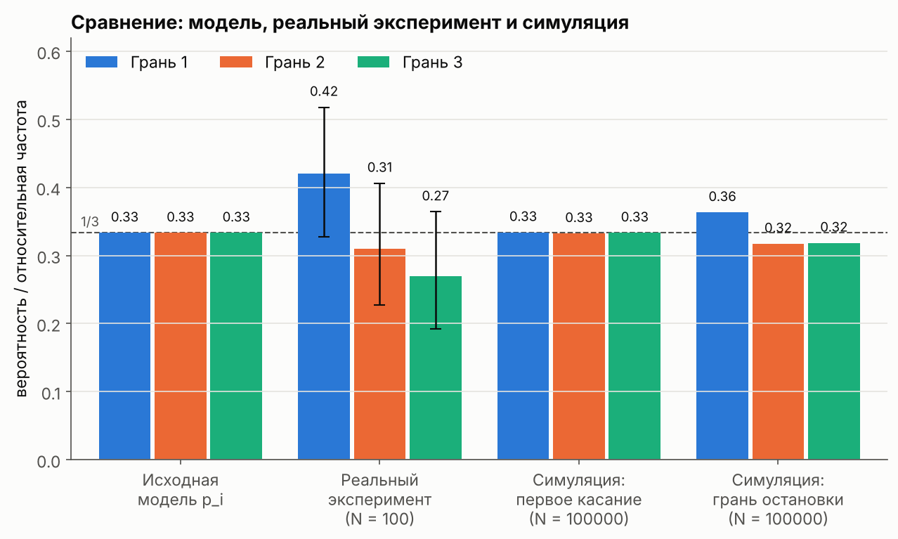
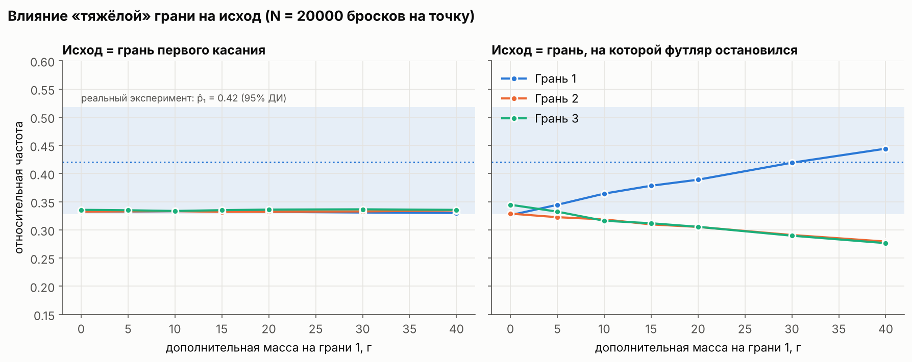

# Бросок треугольного футляра: физическая симуляция (ЛР №1, раздел 4)



Футляр для очков — треугольная призма, боковые грани помечены **1, 2, 3**.
Предположение: грань 1 немного тяжелее остальных, поэтому «1» будет выпадать чаще.
Реальный эксперимент (N = 100): **1 → 42, 2 → 31, 3 → 27**.

Здесь бросок моделируется как движение **твёрдого тела**. Исход каждого компьютерного броска
получается **только из физики** (начальные условия + уравнения движения). Никакие вероятности
заранее не задаются: частоты считаются по фактически выпавшим граням, как и в реальном эксперименте.

## Файлы

| файл | что внутри |
|---|---|
| `lab1_simulation.ipynb` | ноутбук для Google Colab, всё в одном: загрузить → «Выполнить всё» |
| `case_sim.py` | физическая модель: геометрия, массы, тензор инерции, полёт, удары, остановка |
| `experiment.py` | серии бросков, частоты, χ², доверительные интервалы, графики |
| `animate.py` | 3D-анимация одного броска и серии бросков; спецэффекты включаются `fx=True` |
| `run_all.py` | запускает всё сразу и складывает результаты в `results/` |
| `results/` | готовые графики, анимации (`.gif`, `.mp4`) и сводка `summary.md` |

## Как запустить

**Google Colab:** загрузить `lab1_simulation.ipynb` и выбрать «Среда выполнения → Выполнить всё».
Параметры своего футляра (размеры, масса, насколько тяжелее грань 1) задаются в разделе 2 ноутбука.

**Локально:**

```bash
pip install -r requirements.txt   # для .mp4/.gif нужен ещё ffmpeg
python run_all.py                 # всё: N = 10…10^5, графики, анимации (~5 мин)
python run_all.py --quick         # быстрее: N до 10^4, без перебора масс
```

Без `numba` код тоже работает, но примерно в 100 раз медленнее.

## Анимации

| | |
|---|---|
| `results/throw.gif` / `.mp4` | один бросок со спецэффектами: лазерное сопровождение, прицел на точке падения, взрыв, ударные волны, тряска камеры, огненный след, HUD |
| `results/throw_clean.gif` / `.mp4` | тот же бросок без спецэффектов, для отчёта |
| `results/series.gif` / `.mp4` | 10 бросков подряд со «счётчиком» и столбиками частот (пунктир — реальный эксперимент) |

Справа от 3D-вида показаны высота над полом и косинус угла между внешней нормалью каждой грани и
направлением вниз. Момент первого касания замедлен в 20 раз и показан стоп-кадром. Исход — грань,
у которой в этот момент косинус наибольший. Спецэффекты только для красоты: физика и исходы в обеих
версиях одинаковые.



## Модель (для раздела 4 отчёта)

### Объект

* Прямая призма, в сечении равносторонний треугольник со стороной **5,5 см**, длина **16 см**.
* Корпус — тонкостенная оболочка массой **50 г**, масса равномерно распределена по всем пяти граням.
* На грани 1 равномерно размазана дополнительная масса **8 г** («грань 1 тяжелее»). Из-за неё центр
  масс смещается к грани 1 на **2,2 мм**.
* Центр масс и тензор инерции считаются из этого распределения масс (интегрирование по поверхности).

Все числа — параметры (`CaseParams` в `case_sim.py`). Лучше подставить измерения своего футляра.

### Что считается случайным (процедура броска)

| величина | распределение |
|---|---|
| начальная ориентация | равномерно на множестве всех поворотов (нормированный 4-мерный гауссов кватернион) |
| высота центра масс h₀ | U(0,9; 1,1) м |
| вертикальная скорость v_z (вверх) | U(0,5; 2,5) м/с |
| горизонтальная скорость v_x, v_y | N(0; 0,3) м/с |
| ось вращения | равномерно на сфере |
| модуль угловой скорости ω | U(5; 25) рад/с (≈ 1–4 оборота в секунду) |

Неслучайные параметры: пол горизонтальный; коэффициент восстановления при ударе e = 0,3;
коэффициент трения μ = 0,4; g = 9,81 м/с².

### Правило исхода

Как в физическом эксперименте — **тип первого касания**. Первое касание призмы о пол почти всегда
происходит вершиной. Исходом считается та боковая грань, внешняя нормаль которой в этот момент
направлена ближе всего вниз, то есть грань, «которой футляр ударился». Дополнительно записывается
грань, на которой футляр в итоге остановился. Это нужно для сравнения с наблюдением, если на практике
фиксировалось конечное положение.

### Уравнения движения и численный метод

* **Полёт.** Центр масс движется с ускорением g. Вращение свободное: момент импульса **L**
  сохраняется, угловая скорость ω = I(t)⁻¹ L (уравнения Эйлера для несимметричного волчка).
  Интегрируется симметричным расщеплением по главным осям инерции: каждый подшаг — точный поворот,
  поэтому энергия вращения не «уплывает» (проверено: относительная погрешность ~10⁻⁶).
* **Удары и контакт.** Это импульсный метод (sequential impulses, как в игровых физических движках).
  В каждой вершине, ушедшей под пол, ищутся нормальный импульс (с коэффициентом восстановления) и
  импульс трения (конус Кулона |J_t| ≤ μ J_n).
* **Остановка.** Скорость < 2 см/с и угловая скорость < 0,3 рад/с в течение 0,2 с.
* Шаг по времени 1 мс. Один бросок длится около 1,3 с модельного времени, 10⁵ бросков считаются
  примерно за 40 с.

### Предположения и упрощения

* Футляр абсолютно твёрдый, рёбра острые (на самом деле они скруглены), крышка не открывается.
* Сопротивление воздуха не учитывается: при скоростях до 5 м/с и массе ~60 г оно мало.
* Удар описывается одним коэффициентом восстановления и одним коэффициентом трения. Деформации
  и вибрации не моделируются.
* Броски независимы, начальные условия берутся из распределений выше. Реальная рука может
  систематически держать футляр одной гранью вниз, а модель этого не учитывает.

## Результаты

Полная сводка: [`results/summary.md`](results/summary.md).

| N | p̂₁ (1-е касание) | p̂₂ | p̂₃ | p̂₁ (остановка) | p̂₂ | p̂₃ |
|---:|---:|---:|---:|---:|---:|---:|
| 10 | 0,500 | 0,100 | 0,400 | 0,300 | 0,300 | 0,400 |
| 100 | 0,440 | 0,360 | 0,200 | 0,350 | 0,360 | 0,290 |
| 1 000 | 0,351 | 0,337 | 0,312 | 0,367 | 0,312 | 0,321 |
| 10 000 | 0,332 | 0,344 | 0,324 | 0,363 | 0,320 | 0,317 |
| 100 000 | **0,334** | **0,333** | **0,333** | **0,363** | **0,317** | **0,319** |

(По правилу «остановка» примерно 0,07 % бросков заканчиваются стоя на торце, поэтому сумма чуть меньше 1.)





Проверка согласия реальных данных (42/31/27) по критерию χ² Пирсона (2 степени свободы):

| гипотеза | χ² | p-value |
|---|---:|---:|
| равновероятная модель p = (1/3, 1/3, 1/3) | 3,62 | 0,16 |
| симуляция, первое касание | 3,56 | 0,17 |
| симуляция, грань остановки | 1,64 | 0,44 |

95 % доверительный интервал для p₁ по реальным данным: **[0,33; 0,52]**. В него попадает и 1/3.

### Главный физический вывод: что делает «тяжёлая» грань



* **В полёте тяжёлая грань ни на что не влияет.** Сила тяжести приложена к центру масс и не создаёт
  момента, поэтому вращение в воздухе свободное. При равномерно случайной начальной ориентации к
  моменту первого касания все три грани равноправны. Симуляция это подтверждает: p̂ ≈ 1/3 по правилу
  первого касания при любой добавочной массе от 0 до 40 г.
* **Тяжёлая грань работает только после удара.** Футляр подпрыгивает, кувыркается и укладывается.
  Положение «тяжёлой гранью вниз» энергетически выгоднее: центр масс ниже, и перевалиться с этой грани
  труднее. По правилу «на какой грани остановился» p̂₁ растёт: 0,33 → 0,36 (8 г) → 0,42 (30 г) → 0,44 (40 г).
* Реальные 42 % для грани 1 по 100 броскам статистически не отличаются ни от 1/3 (p = 0,16), ни от
  результата симуляции. Если перекос не случайный, скорее всего фиксировалась грань остановки, а не
  первого касания, или рука систематически бросала футляр одинаково.

## Подсказки к разделу 6 (что можно написать в отчёте)

1. **Насколько модель описывает эксперимент.** Расхождения есть (0,42 против 0,33 у грани 1), но по
   критерию χ² при N = 100 они не значимы (p = 0,16).
2. **Чаще/реже, чем предсказано.** Грань 1 выпадала чаще, грани 2 и 3 — реже.
3–4. **Предположения и что могло быть неверным:** равновероятность ориентации при броске
   (рука не идеально случайна) и то, что тяжёлая грань влияет на первое касание (по физике в полёте не влияет).
5. **Неучтённые факторы:** скругления рёбер, упругость и шероховатость пола, деформация футляра,
   открывающаяся крышка, манера броска.
6. **Частоты при росте N.** Колебания убывают примерно как 1/√N: при N = 10 частоты скачут на ±0,15,
   при N = 10⁵ стабилизируются с точностью около ±0,003.
7. **Упрощения компьютерной модели** перечислены выше. Сильнее всего на результат по правилу
   остановки влияют e, μ и форма рёбер; на правило первого касания — распределение начальной ориентации.
8. **Причины отклонений.** p̂_phys от p_i отклоняется из-за малого N (случайная ошибка порядка
   √(p(1−p)/N) ≈ 0,047) и, возможно, неточности модели. p̂_sim от p_i при N = 10⁵ отклоняется
   только из-за упрощений модели, потому что случайная ошибка там ≈ 0,0015.
9. **Можно ли отвергнуть модель по 100 броскам.** Нет: p-value 0,16 > 0,05. Чтобы уверенно заметить
   эффект 0,36 против 0,33, нужно около 2000 бросков.
10. **Как уточнить модель.** Взять p₁ из симуляции с реальными массами и размерами. Если фиксируется
    конечное положение, использовать правило «грань остановки». Измерить e и μ для своего пола.
